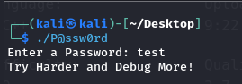
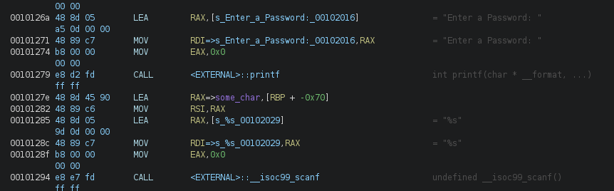
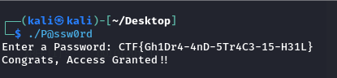
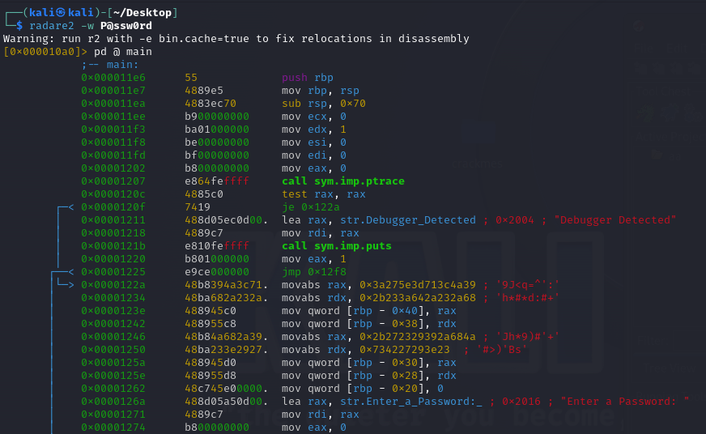
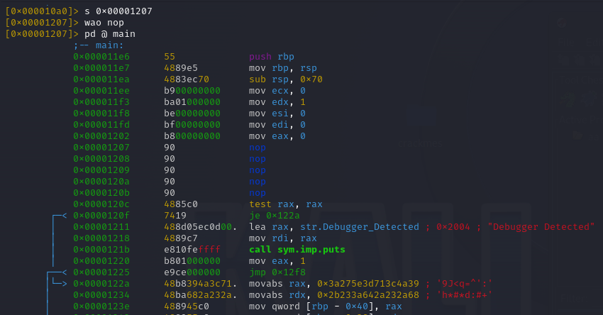

### crackme id: 64e91b92d931496abf9091e3
### BEST VIEWED THRU VSCODE OR OTHER MARKDOWN READER

# The thought process
I started by executing the crackme:



Then, I loaded the crackme into Ghidra, opened it with Code Viewer and was greeted with this `main()` function:

```cpp
undefined8 main(void)
{
  long lVar1;
  undefined8 uVar2;
  int __edflag;
  char local_78 [48];
  undefined8 local_48;
  undefined8 local_40;
  undefined8 local_38;
  undefined8 local_30;
  undefined8 local_28;
  int local_14;
  char *local_10;
  
  lVar1 = ptrace(PTRACE_TRACEME,0,1,0);
  if (lVar1 == 0) {
    // this is probably one long string
    local_48 = 0x3a275e3d713c4a39;
    local_40 = 0x2b233a642a232a68;
    local_38 = 0x2b272329392a684a;
    local_30 = 0x734227293e23;
    local_28 = 0;
    printf("Enter a Password: ");
    __edflag = (int)local_78;
    __isoc99_scanf(&DAT_00102029);
    encrypt(local_78,__edflag);
    local_10 = local_78;
    local_14 = strcmp(local_10,(char *)&local_48);
    if (local_14 == 0) {
      printf("Congrats, Access Granted!!");
    }
    else {
      printf("Try Harder and Debug More!");
    }
    uVar2 = 0;
  }
  else {
    puts("Debugger Detected");
    uVar2 = 1;
  }
  return uVar2;
}
```

To remove the clutter, I renamed some of the variables and retyped `local_48` as `char[40]`:

```cpp
undefined8 main(void)
{
  int strcmp_retval;
  long ptrace_retval;
  undefined8 retval;
  char some_char [48];
  char local_48 [40];
  
  ptrace_retval = ptrace(PTRACE_TRACEME,0,1,0);
  if (ptrace_retval == 0) {
    // Ghidra decided to assign it individually by index, ill spare you that sight
    local_48 = "9J<q=^':h*#*d:#+Jh*9)#'+#>)'Bs";
    printf("Enter a Password: ");
    strcmp_retval = (int)some_char;
    // dont worry about scanf() not having a 2nd argument
    __isoc99_scanf("%s");
    encrypt(some_char,strcmp_retval);
    strcmp_retval = strcmp(some_char,local_48);
    if (strcmp_retval == 0) {
      printf("Congrats, Access Granted!!");
    }
    else {
      printf("Try Harder and Debug More!");
    }
    retval = 0;
  }
  else {
    puts("Debugger Detected");
    retval = 1;
  }
  return retval;
}
```

The use of `ptrace()` is actually quite interesting - in this context, the program tries to initiate itself as a tracee (the process to be traced by its parent process) and if it fails in that, it assumes it to be because it's already being traced (for example by the using something like `strace`!).

The issue with `scanf()` here is probably on Ghidra (I'm not that familiar with it), so I took a look at the disassembly, just to be sure:



So yeah, seems like the 2nd argument to `scanf()` is `some_char`. I renamed it `input`, for clarity.

The only piece of the puzzle left is the `encrypt()` function:

```cpp
void encrypt(char *__block, int __edflag)
{
  size_t sVar1;
  int local_1c;
  
  local_1c = 0;
  while (true) {
    sVar1 = strlen(__block);
    if (sVar1 <= (ulong)(long)local_1c) break;
    __block[local_1c] = __block[local_1c] + -10;
    local_1c = local_1c + 1;
  }
  return;
}
```

After some renaming and minor adjustments:

```cpp
void encrypt(char *__block, int __edflag)
{
  size_t str_size;
  int i;
  
  i = 0;
  while (true) {
    str_size = strlen(__block);
    if (str_size <= i) break;
    __block[i] = __block[i] -10;
    i++;
  }
  return;
}
```

So, it seems that the `encrypt()` function just subtracts 10 from every letter in `input`.

Given all that, I created a small keygen that reverses the encryption and generates the password from the encrypted key:

```py
key = "9J<q=^':h*#*d:#+Jh*9)#'+#>)'Bs"

for letter in key:
    key_decrypted += chr(ord(letter) + 10)

print(key_decrypted)
```

Obviously, you can do the ascii shift by hand if you want :)

The keygen generates the password `CTF{Gh1Dr4-4nD-5Tr4C3-15-H31L}`, which proves to be correct:



### Patching to remove the the `ptrace()` call
Given the `ptrace()` guard, the program can't be subjected to dynamic analysis via a debugger. 

However, we can modify the binary to remove the `CALL` assembly instruction, which would get rid of the guard.

Here, I used `radare2` with the `-w` flag enabled to patch the binary:



The `CALL` instruction is at address `0x00001207`, so i moved to it using `s`, then used `wao nop` to replace the current instruction with `NOP`s:

