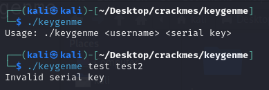
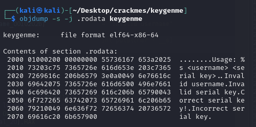
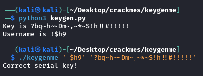

### crackme id: 5e2c557933c5d419aa013658
### BEST VIEWED THRU VSCODE OR OTHER MARKDOWN READER

# The thought process
I started by executing the file:



I then checked the `.rodata` section to see whether it would yield any information (e.g. a hardcoded password):




No luck here. I loaded the file into Ghidra and was greeted with the following `main()` function:

```cpp
// i took the liberty of renaming and retyping param_1 and param_2 to argc and argv
undefined8 main(int param_1,char **argv)
{
  char cVar1;
  char *__s;
  char *pcVar2;
  int iVar3;
  int iVar4;
  size_t sVar5;
  double dVar6;
  double dVar7;
  int local_3c;
  int local_38;
  int local_34;
  int local_30;
  
  if (param_1 < 3) {
    printf("Usage: %s <username> <serial key>\n",*argv);
  }
  else {
    sVar5 = strlen(argv[1]);
    if (sVar5 < 4) {
      puts("Invalid username");
    }
    else {
      __s = argv[2];
      sVar5 = strlen(__s);
      if (sVar5 == 0x19) {
        iVar3 = (int)argv[1][2];
        pcVar2 = argv[1];
        sVar5 = strlen(argv[1]);
        iVar4 = (int)pcVar2[sVar5 - 1];
        if (iVar4 < iVar3) {
          sVar5 = strlen(argv[1]);
          local_3c = (int)argv[1][1] + ((int)((ulong)(long)iVar3 / sVar5) - iVar4);
        }
        else if (iVar3 < iVar4) {
          sVar5 = strlen(argv[1]);
          local_3c = (int)argv[1][1] + ((int)((ulong)(long)iVar4 / sVar5) - iVar3);
        }
        else {
          sVar5 = strlen(argv[1]);
          local_3c = (int)argv[1][1] + (int)sVar5;
        }
        cVar1 = *argv[1];
        local_38 = 0;
        local_34 = 1;
        for (local_30 = 0; sVar5 = strlen(__s), (ulong)(long)local_30 < sVar5;
            local_30 = local_30 + 1) {
          local_38 = local_38 + __s[local_30] * local_34;
          local_34 = (int)__s[local_30];
        }
        if (local_38 == 0x255a8 - cVar1 * local_3c) {
          dVar6 = pow((double)(int)__s[0x13],(double)(int)__s[1]);
          dVar7 = pow((double)(int)*__s,(double)(int)__s[2]);
          if ((((dVar6 - dVar7 < 0.0) && (0 < (int)*__s - (int)__s[0x13])) &&
              ((int)__s[0xc] + (int)__s[7] < 0x8c)) &&
             ((int)__s[10] * (int)__s[8] <= (int)__s[0x10] * (int)__s[4])) {
            puts("Correct serial key!");
            return 0;
          }
        }
        puts("Incorrect serial key");
      }
      else {
        puts("Invalid serial key");
      }
    }
  }
  return 0;
}
```

Even before delving deeper into the generated code the condition after the 1st `if` stands out - **the username can't be shorter than 4 characters**.

I renamed some variables and changed the representation (*Right Click -> Make Equate*) of some literals:

```cpp
undefined8 main(int argc,char **argv)
{
  int user_3rd_lett;
  int user_penult_lett;
  size_t str_len;
  double some_pow_1;
  double some_pow_2;
  int multiplier;
  int final_check;
  int prev_letter_ord;
  int i;
  char *serial_key;
  char user_1st_lett;
  char *username;
  
  if (argc < 3) {
    printf("Usage: %s <username> <serial key>\n",*argv);
  }
  else {
    str_len = strlen(argv[1]);
    if (str_len < 4) {
      puts("Invalid username");
    }
    else {
      serial_key = argv[2];
      str_len = strlen(serial_key);
      if (str_len == 25) {
        user_3rd_lett = (int)argv[1][2];
        username = argv[1];
        str_len = strlen(argv[1]);
        user_penult_lett = (int)username[str_len - 1];
        if (user_penult_lett < user_3rd_lett) {
          str_len = strlen(argv[1]);
          multiplier = (int)argv[1][1] +
                       ((int)((ulong)(long)user_3rd_lett / str_len) - user_penult_lett);
        }
        else if (user_3rd_lett < user_penult_lett) {
          str_len = strlen(argv[1]);
          multiplier = (int)argv[1][1] +
                       ((int)((ulong)(long)user_penult_lett / str_len) - user_3rd_lett);
        }
        else {
          str_len = strlen(argv[1]);
          multiplier = (int)argv[1][1] + (int)str_len;
        }
        user_1st_lett = *argv[1];
        final_check = 0;
        prev_letter_ord = 1;
        for (i = 0; str_len = strlen(serial_key), (ulong)(long)i < str_len; i = i + 1) {
          final_check = final_check + serial_key[i] * prev_letter_ord;
          prev_letter_ord = (int)serial_key[i];
        }
        if (final_check == 153000 - user_1st_lett * multiplier) {
          some_pow_1 = pow((double)(int)serial_key[19],(double)(int)serial_key[1]);
          some_pow_2 = pow((double)(int)*serial_key,(double)(int)serial_key[2]);
          if ((((some_pow_1 - some_pow_2 < 0.0) && (0 < (int)*serial_key - (int)serial_key[19])) &&
              ((int)serial_key[12] + (int)serial_key[7] < 140)) &&
             ((int)serial_key[10] * (int)serial_key[8] <= (int)serial_key[16] * (int)serial_key[4]))
          {
            puts("Correct serial key!");
            return 0;
          }
        }
        puts("Incorrect serial key");
      }
      else {
        puts("Invalid serial key");
      }
    }
  }
  return 0;
}
```

Another big piece of information that is clearly visible now is that `serial_key` needs to be exactly 25 characters long.

`username` variable needs to be only 4 characters or longer - should be easier start with that instead.

Starting here:

```cpp
user_3rd_lett = (int)argv[1][2];
username = argv[1];
str_len = strlen(argv[1]);
user_penult_lett = (int)username[str_len - 1];
if (user_penult_lett < user_3rd_lett) {
  str_len = strlen(argv[1]);
  multiplier = (int)argv[1][1] +
                ((int)((ulong)(long)user_3rd_lett / str_len) - user_penult_lett);
}
else if (user_3rd_lett < user_penult_lett) {
  str_len = strlen(argv[1]);
  multiplier = (int)argv[1][1] +
                ((int)((ulong)(long)user_penult_lett / str_len) - user_3rd_lett);
}
else {
  str_len = strlen(argv[1]);
  multiplier = (int)argv[1][1] + (int)str_len;
}
```

All these checks seem pretty complicated and intermingled with each other. However, if we look further into the code, only `multiplier` and the 1st letter of `username` (`user_1st_lett`) are referenced in later checks.

Therefore, instead of checking all the different `username` combinations in the keygen, we can only check all the possible `multiplier` and `user_1st_lett` combinations, and then randomly select a `username` that matches them.

Moving on to the next part of the code:

```cpp
user_1st_lett = *argv[1];
final_check = 0;
prev_letter_ord = 1;
for (i = 0; str_len = strlen(serial_key), (ulong)(long)i < str_len; i = i + 1) {
  final_check = final_check + serial_key[i] * prev_letter_ord;
  prev_letter_ord = (int)serial_key[i];
}
```

This is a basic for loop that amounts to assigning `final_check` with the sum of squares of all the letters in `serial_key` (except the 1st one, which is not squared).

Moving on:

```cpp
if (final_check == 153000 - user_1st_lett * multiplier) {
  some_pow_1 = pow((double)(int)serial_key[19],(double)(int)serial_key[1]);
  some_pow_2 = pow((double)(int)*serial_key,(double)(int)serial_key[2]);
  if ((((some_pow_1 - some_pow_2 < 0.0) && (0 < (int)*serial_key - (int)serial_key[19])) &&
      ((int)serial_key[12] + (int)serial_key[7] < 140)) &&
      ((int)serial_key[10] * (int)serial_key[8] <= (int)serial_key[16] * (int)serial_key[4]))
  {
    puts("Correct serial key!");
    return 0;
  }
```

The important thing to notice is that these inner checks only reference `serial_key` (they aren't impacted by changing the value of `username`):
- `serial_key[19] ** serial_key[1] - serial_key[0] ** serial_key[2] < 0`
- `serial_key[0] - serial_key[19] > 0`
- `serial_key[12] + serial_key[7] < 140`
- `serial_key[10] * serial_key[8] <= serial_key[16] * serial_key[4]`

They may seem daunting at first, but they are actually numerically pretty easy to satisfy - to the point that generating a random `serial_key` and checking it against them would be feasible.

Then, from that, one could find the value of `final_check` and then use the outer check (`final_check == 153000 - user_1st_lett * multiplier`) to find any combination of  `user_1st_letter` and `multiplier` that matches it, then generate any `username` that matches these.

If you look closely, you can see that there are some indices of `serial_key` that aren't used - namely: 3, 5, 6, 9, 11, 13, 14, 15, 17, 18, 20, 21, 22, 23, 24. These can be used to influence the value of `final_check` without having to worry about the other checks.

### Keygen

I then constructed a keygen (`keygen.py` in the .zip) that takes all this into account. It generates usernames that are only 4 characters long (since there is no need for more), it doesn't randomly fill out the "unused" indices in `serial_key` (since it's not necessary) and it doesn't take into account characters that could be problematic to get a shell to not parse (like `'`). All this however is easy to fix in the code, if one wishes to do so.

It does yield a correct username and serial key combo in each use, though:

